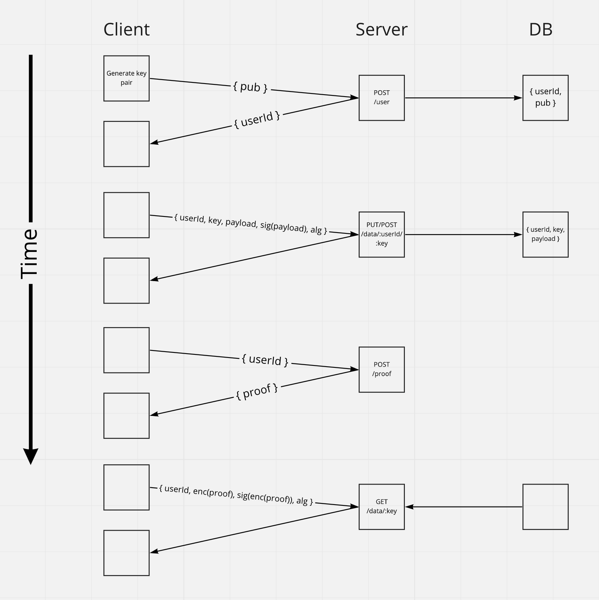

#### Zk Server

This represents a prototype of no-knowledge data store. At a high level, any client may store data here, but only in encrypted form. A user account is created anonymously by uploading a public key to the server. Data updates are then protected by RSA signature. The only stored data is the public key, the encrypted data, and allowed proofs, as described below.

To retrieve data, a basic proof system has been created. The client requests a payload from the server, which the server has encrypted using the public key. On subsequent requests to read data, the plaintext value of the proof must be provided in the header. The server can then validate that the owner of the private key is requesting the data. Each GET requires a new proof.

#### Setup

- Install docker and dotnet.
- Run postgres using provided docker-compose (i.e. `docker-compose up`). This will also run adminer, default login is `postgres`, password `example`.
- Run server with `dotnet run` or `dotnet watch run`.

#### Development Notes

- dotnet ef dbcontext scaffold "Host=localhost;Database=zk;Username=postgres;Password=example" Npgsql.EntityFrameworkCore.PostgreSQL -o Models
